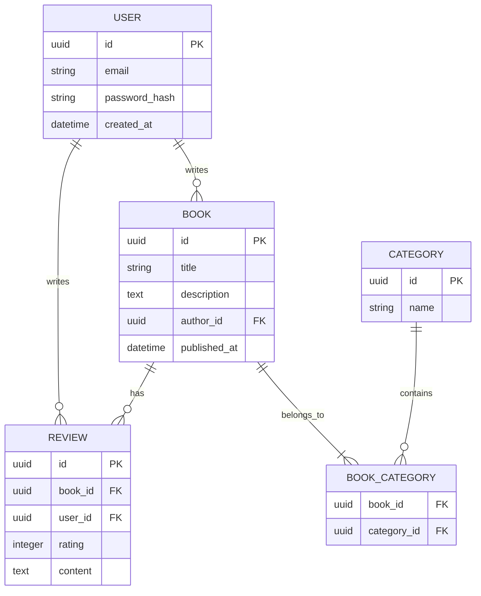

# 데이터베이스 스키마 문서

## 1. ERD 다이어그램


## 2. 테이블 상세 정의

### users 테이블
| 컬럼 | 타입 | 설명 | 제약조건 |
|------|------|------|----------|
| id | UUID | 사용자 고유 식별자 | PRIMARY KEY |
| email | VARCHAR(255) | 이메일 주소 | UNIQUE, NOT NULL |
| password_hash | VARCHAR(255) | 암호화된 비밀번호 | NOT NULL |
| created_at | TIMESTAMPTZ | 생성 일시 | DEFAULT NOW() |

### books 테이블
| 컬럼 | 타입 | 설명 | 제약조건 |
|------|------|------|----------|
| id | UUID | 도서 고유 식별자 | PRIMARY KEY |
| title | VARCHAR(255) | 도서 제목 | NOT NULL |
| description | TEXT | 도서 설명 | |
| author_id | UUID | 저자 ID | FOREIGN KEY (users.id) |
| published_at | TIMESTAMPTZ | 출판 일시 | |

## 3. 인덱스 전략
```sql
-- 검색 성능 향상을 위한 인덱스
CREATE INDEX idx_books_title ON books USING gin(title gin_trgm_ops);
CREATE INDEX idx_books_author ON books(author_id);

-- 리뷰 조회 최적화
CREATE INDEX idx_reviews_book ON reviews(book_id);
CREATE INDEX idx_reviews_user ON reviews(user_id);
```

## 4. 마이그레이션 계획
```ts
// migrations/20240607000000_initial_schema.ts
export async function up(pg: Knex): Promise<void> {
  await pg.schema.createTable('users', (table) => {
    table.uuid('id').primary();
    table.string('email').unique().notNullable();
    table.string('password_hash').notNullable();
    table.timestamp('created_at').defaultTo(pg.fn.now());
  });

  await pg.schema.createTable('books', (table) => {
    table.uuid('id').primary();
    table.string('title').notNullable();
    table.text('description');
    table.uuid('author_id').references('id').inTable('users');
    table.timestamp('published_at');
  });
}
```

## 5. 데이터 시딩 예시
```ts
// seeds/initial_data.ts
export async function seed(pg: Knex): Promise<void> {
  await pg('users').insert([
    {
      id: '550e8400-e29b-41d4-a716-446655440000',
      email: 'author@example.com',
      password_hash: 'hashed_password'
    }
  ]);

  await pg('books').insert([
    {
      id: '3058a1a0-1a1a-4a1a-8a1a-1a1a1a1a1a1a',
      title: '초기 데이터 도서',
      author_id: '550e8400-e29b-41d4-a716-446655440000'
    }
  ]);
}
```

## 6. 백업 전략
```yaml
# backup-strategy.yaml
schedule:
  daily: "0 2 * * *"  # 매일 새벽 2시
retention:
  days: 7
  weeks: 4
  months: 12
storage:
  s3:
    bucket: "willbook-backups"
    region: "ap-northeast-2"