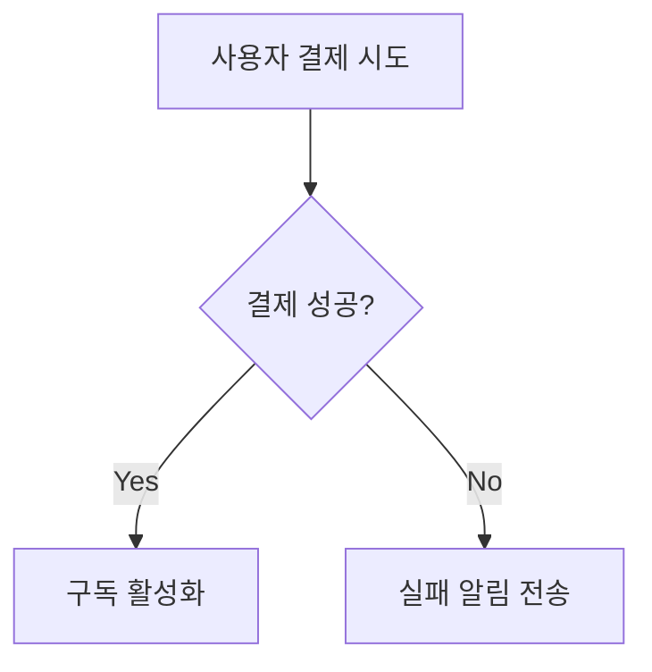

# 기능 요구사항 문서

## 1. 다중 AI 모델 통합
### 요구사항
- OpenAI, Claude, Gemini 등 주요 AI 모델 지원
- 사용자별 API 키 관리 기능
- 모델 전환 인터페이스 제공
- 모델별 출력 품질 비교 기능

### 기술 사양
```typescript
interface AIModelConfig {
  provider: 'openai' | 'anthropic' | 'google';
  apiKey: string;
  modelVersion: string;
  temperature: number;
}
```

## 2. Stripe 구독 결제 시스템
### 요구사항
- 월 $9.99 구독 모델 구현
- 결제 웹훅 처리 시스템
- 구독 상태 관리 대시보드
- 결제 실패 시 자동 재시도 로직

### 흐름도


## 3. Supabase 기반 사용자 관리
### 데이터 모델
```sql
CREATE TABLE users (
  id UUID PRIMARY KEY,
  email TEXT UNIQUE,
  social_provider TEXT,
  ai_config JSONB
);
```

## 4. 자동 출판 파이프라인
### 처리 단계
1. 표지 생성 (AI 이미지 생성)
2. 내부 레이아웃 자동화
3. ISBN 자동 발급
4. 수익 분배 시스템 연동

## 비기능 요구사항
- 응답 시간: AI 호출 시 5초 이내
- 가용성: 99.9% uptime
- 보안: PCI DSS 준수