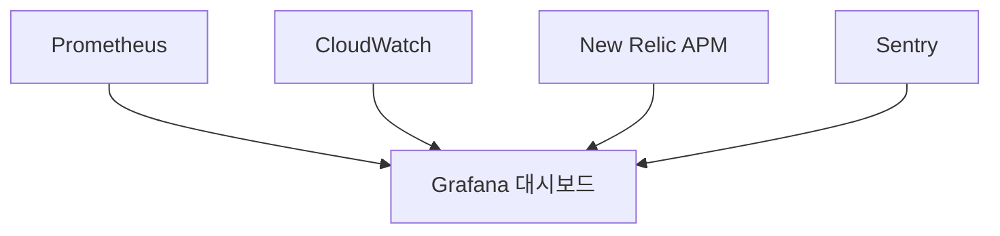
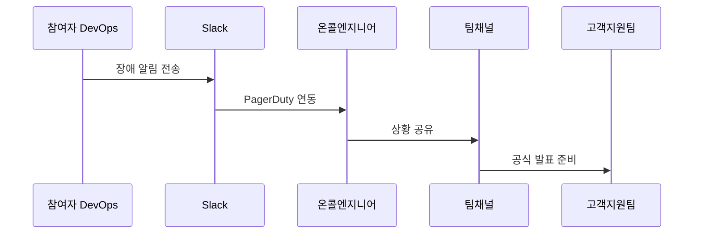

# 운영 가이드 문서

## 1. 시스템 모니터링 구성


## 2. 주요 모니터링 지표
```table
| 카테고리      | 지표                          | 임계값          | 담당자   |
|---------------|-------------------------------|-----------------|----------|
| 서버          | CPU 사용률 > 80%              | 15분 지속       | DevOps   |
| 데이터베이스  | 연결 수 > 200                 | 즉시 알림       | DBA      |
| 애플리케이션  | 5xx 에러 > 1%                 | 5분 내 확인     | 개발팀   |
| 비즈니스      | 주문량 50% 감소               | 1시간 내 분석   | PM       |
```

## 3. 장애 대응 절차
```bash
# 장애 발생 시 첫 10분 체크리스트
1. 확인 서비스 상태: curl -I https://api.willbook.co.kr/health
2. 로그 확인: kubectl logs -f deployment/willbook-api --tail=100
3. 메트릭 확인: open https://grafana.willbook.co.kr
4. 롤백 준비: git tag | grep prod- | tail -2
```

## 4. 백업 전략
```yaml
# backup-cronjob.yaml
apiVersion: batch/v1beta1
kind: CronJob
metadata:
  name: db-backup
spec:
  schedule: "0 3 * * *"
  jobTemplate:
    spec:
      template:
        spec:
          containers:
          - name: backup
            image: postgres:13
            command: ["pg_dump", "-h", "$DB_HOST", "-U", "$DB_USER", "-d", "$DB_NAME", "-f", "/backup/$(date +%Y%m%d).sql"]
          restartPolicy: OnFailure
```

## 5. 용량 관리 계획
```javascript
// auto-scaling.js
const scalingRules = {
  api: {
    scaleUp: {
      cpu: 70, // %
      duration: 300, // seconds
      increment: 20 // %
    },
    scaleDown: {
      cpu: 30,
      duration: 600,
      decrement: 10
    }
  },
  db: {
    storageThreshold: 85, // %
    resizeStep: 20 // GB
  }
};
```

## 6. 운영 체크리스트
```checklist
- [ ] 매일 09:00 서비스 상태 점검
- [ ] 주간 백업 검증 테스트
- [ ] 월별 장애 대응 드릴 수행
- [ ] 분기별 용량 검토 회의
```

## 7. 커뮤니케이션 프로토콜


## 8. 유지보수 창 관리
```bash
# 유지보수 모드 활성화
kubectl apply -f maintenance-on.yaml

# 점검 완료 후
kubectl apply -f maintenance-off.yaml