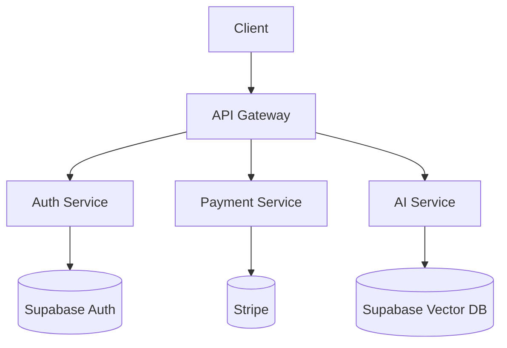
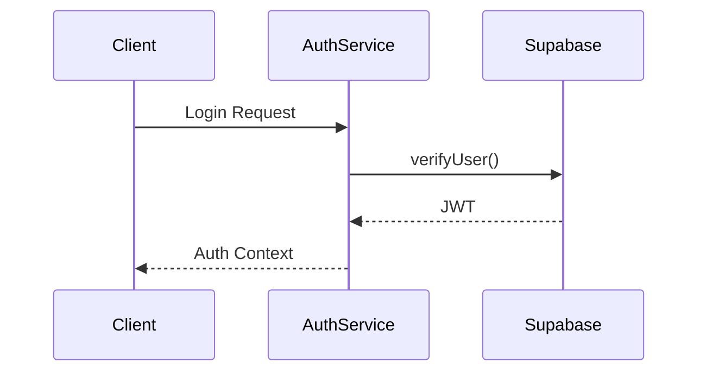
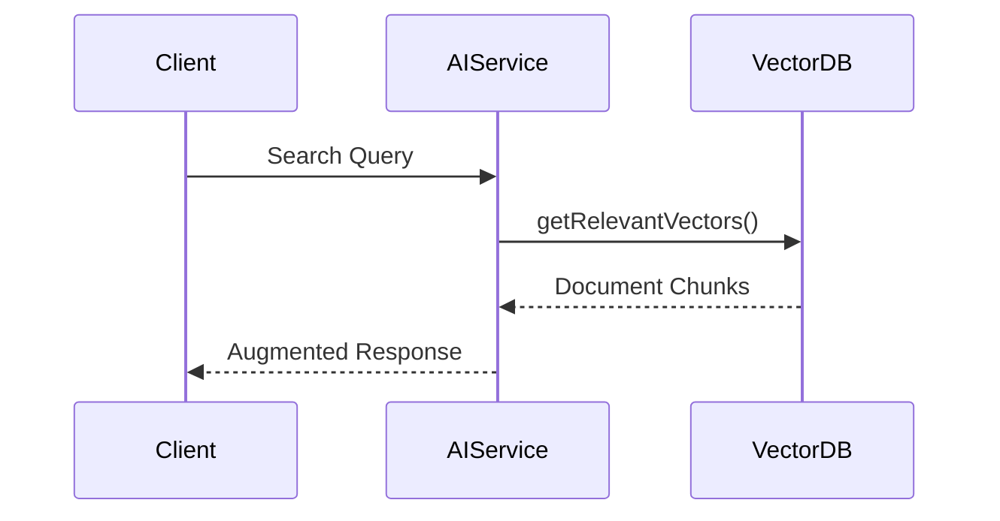

# Willbook 프로젝트 구조

## 1. 전체 아키텍처


## 2. 디렉토리 구조
```
willbook/
├── src/
│   ├── auth/               # 인증 시스템
│   │   ├── providers/      # Auth Providers
│   │   ├── hooks/          # 커스텀 훅
│   │   └── types/          # 타입 정의
│   ├── payments/           # 결제 시스템
│   ├── ai/                 # AI 통합
│   │   ├── rag/            # RAG 구현
│   │   └── embeddings/     # 임베딩 처리
│   └── shared/             # 공유 컴포넌트
├── docs/                   # 프로젝트 문서
└── scripts/                # 배포/운영 스크립트
```

## 3. 주요 모듈 상호작용
### 3.1 인증 흐름


### 3.2 RAG 검색 흐름


## 4. 기술 스택 매핑
| 기능 영역       | 기술 스택                  |
|----------------|---------------------------|
| 인증           | Supabase Auth, JWT        |
| 데이터         | Supabase Postgres         |
| 벡터 검색      | Supabase Vector, OpenAI   |
| 결제           | Stripe API                |
| 클라이언트     | Next.js, TailwindCSS      |