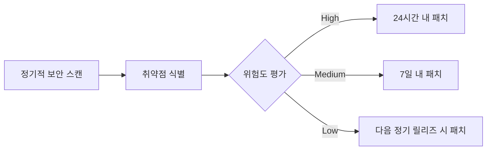

# 보안 가이드라인

## 1. 인증 및 접근 제어
```typescript
// JWT 검증 미들웨어 예제
import { verify } from 'jsonwebtoken';

export const authMiddleware = (req, res, next) => {
  const token = req.headers.authorization?.split(' ')[1];
  if (!token) return res.status(401).send('Access denied');

  try {
    const decoded = verify(token, process.env.JWT_SECRET);
    req.user = decoded;
    next();
  } catch (err) {
    res.status(400).send('Invalid token');
  }
};
```

## 2. 데이터 보호
```sql
-- 개인정보 암호화 예제
CREATE TABLE users (
  id SERIAL PRIMARY KEY,
  email TEXT NOT NULL,
  phone TEXT NOT NULL,
  ssn BYTEA -- 암호화된 주민등록번호
);

-- 암호화 함수
CREATE EXTENSION pgcrypto;
INSERT INTO users (email, phone, ssn)
VALUES (
  'user@example.com',
  '010-1234-5678',
  pgp_sym_encrypt('123456-7890123', 'encryption_key')
);
```

## 3. 로깅 정책
```yaml
# winston-logger.config.js
module.exports = {
  transports: [
    new winston.transports.File({
      filename: 'secure-audit.log',
      level: 'info',
      format: winston.format.combine(
        winston.format.timestamp(),
        winston.format.json()
      ),
      handleRejections: true
    })
  ],
  rejectionHandlers: [
    new winston.transports.File({ filename: 'rejections.log' })
  ]
};
```

## 4. 취약점 관리 프로세스


## 5. GDPR 준수 항목
```table
| 요구사항          | 구현 방법                          | 담당자   |
|-------------------|-----------------------------------|----------|
| 데이터 접근 권한  | RBAC 기반 접근 제어               | 백엔드팀 |
| 데이터 삭제 요청  | 30일 내 완전 삭제 프로세스        | DBA      |
| 데이터 이동 권리  | 표준 JSON/XML 내보내기 기능       | 프론트팀 |
```

## 6. 보안 헤더 설정
```nginx
# nginx.conf
server {
    add_header X-Frame-Options "DENY";
    add_header X-Content-Type-Options "nosniff";
    add_header Content-Security-Policy "default-src 'self'";
    add_header Strict-Transport-Security "max-age=63072000; includeSubDomains";
    add_header X-XSS-Protection "1; mode=block";
}
```

## 7. 비상 대응 절차
1. **침해 사고 발생 시**:
```bash
# 모든 세션 무효화
redis-cli FLUSHALL

# 임시 조치 배포
kubectl rollout restart deployment/willbook-api
```

2. **포렌식 분석**:
```bash
# 로그 수집
aws s3 cp /var/log/secure s3://willbook-forensics/$(date +%Y%m%d)/
```

## 8. 정기적 감사 항목
```checklist
- [ ] 매월 사용자 권한 검토
- [ ] 분기별 암호화 키 순환
- [ ] 연 2회 침투 테스트 수행
- [ ] 주간 보안 로그 검토