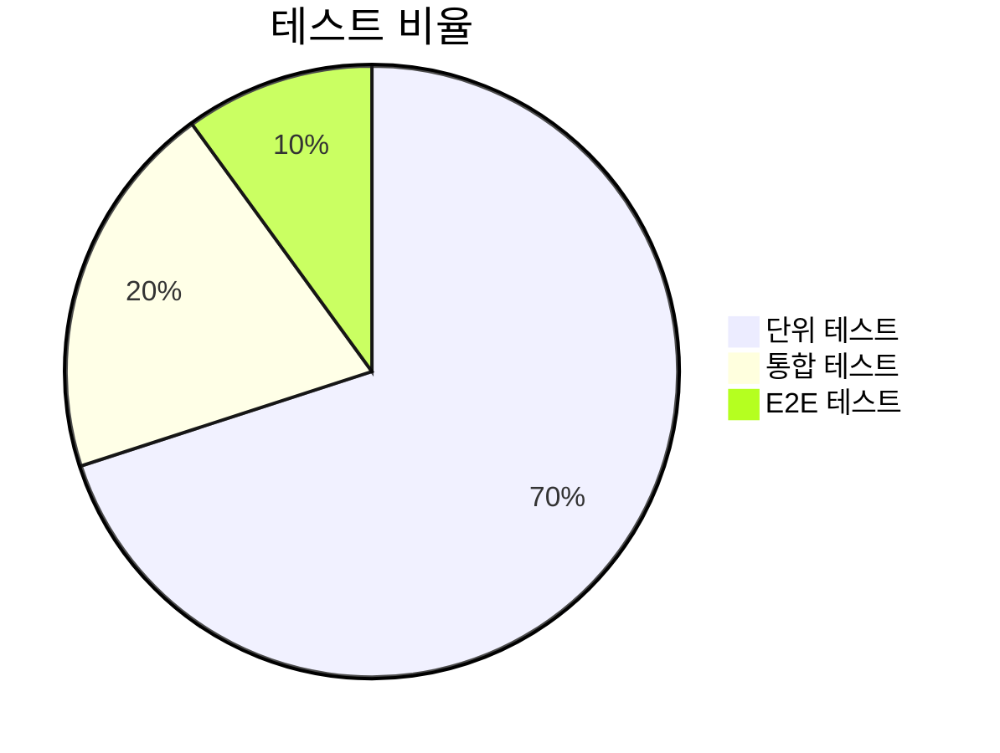

# 테스트 전략 문서

## 1. 테스트 피라미드


## 2. 테스트 환경 구성
```bash
# 테스트 라이브러리 설치
npm install --save-dev jest @testing-library/react @testing-library/jest-dom msw
```

## 3. 단위 테스트 예시 (React 컴포넌트)
```tsx
// BookCard.test.tsx
import { render, screen } from '@testing-library/react';
import BookCard from './BookCard';

test('도서 카드가 제목과 작가를 표시한다', () => {
  render(<BookCard title="테스트 책" author="테스트 작가" />);
  
  expect(screen.getByText('테스트 책')).toBeInTheDocument();
  expect(screen.getByText(/테스트 작가/)).toBeInTheDocument();
});
```

## 4. API 모킹 전략 (MSW)
```ts
// src/mocks/handlers.ts
import { rest } from 'msw';

export const handlers = [
  rest.get('/api/books', (req, res, ctx) => {
    return res(
      ctx.json([{
        id: 1,
        title: '모킹된 책',
        author: '모킹 작가'
      }])
    );
  })
];
```

## 5. 테스트 커버리지 기준
```json
// package.json
"jest": {
  "coverageThreshold": {
    "global": {
      "branches": 80,
      "functions": 85,
      "lines": 85,
      "statements": 85
    }
  }
}
```

## 6. E2E 테스트 시나리오 (Cypress)
```ts
// e2e/bookFlow.cy.ts
describe('도서 등록 플로우', () => {
  it('새 도서를 성공적으로 등록한다', () => {
    cy.visit('/books/new');
    cy.get('[data-testid="title-input"]').type('새로운 도서');
    cy.get('[data-testid="submit-button"]').click();
    cy.url().should('include', '/books');
  });
});
```

## 7. 테스트 데이터 관리
```ts
// test-utils/factories.ts
export const bookFactory = (overrides = {}) => ({
  id: faker.string.uuid(),
  title: faker.lorem.words(3),
  author: faker.person.fullName(),
  ...overrides
});
```

## 8. 성능 테스트 기준
```yaml
# .k6.js
export const options = {
  vus: 100,
  duration: '30s',
  thresholds: {
    http_req_duration: ['p(95)<500']
  }
};