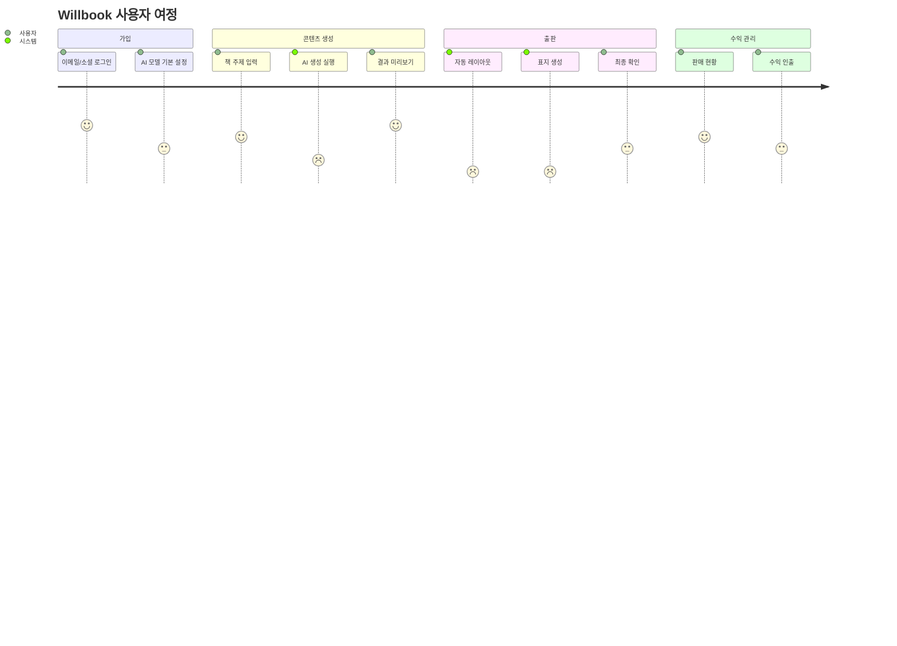
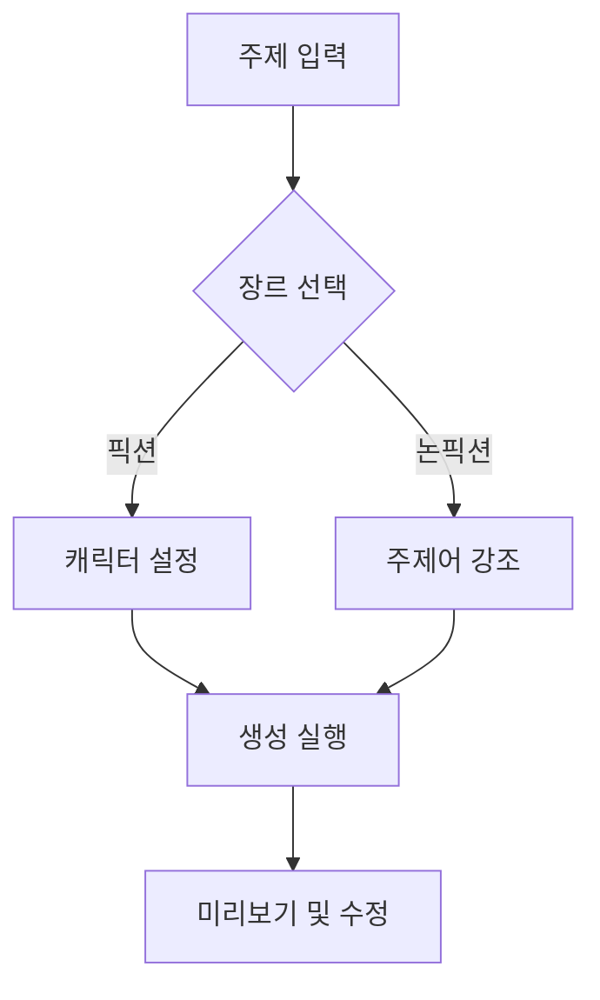

# 사용자 흐름 문서

## 주요 사용자 유형
1. **창작자 (80%)**
   - 기술적 배경 부족
   - 간편한 출판 프로세스 요구
   - 수익 창출에 관심

2. **소규모 출판사 (20%)**
   - 일괄 처리 기능 필요
   - 더 세밀한 제어 요구
   - 비용 효율성 중시

## 코어 사용자 여정

## 세부 흐름별 시나리오

### 1. 가입 및 설정
1. **이메일 가입**
   - 이메일 인증 필수
   - 환영 이메일 자동 발송
2. **AI 모델 설정**
   - 기본 모델: GPT-4
   - 고급 설정: Temperature, Max Tokens 조정

### 2. 콘텐츠 생성

### 3. 출판 프로세스
1. 자동 ISBN 할당
2. 표지 디자인 옵션 3종 제공
3. 출판 플랫폼 자동 연동
   - Amazon KDP
   - Ridibooks
   - Google Play Books

## 예외 흐름
- **결제 실패 시**: 3회 재시도 후 구독 일시정지
- **AI 생성 실패**: 모델 자동 전환 (Fallback)
- **출판 검수 실패**: 수동 검토 큐로 이동